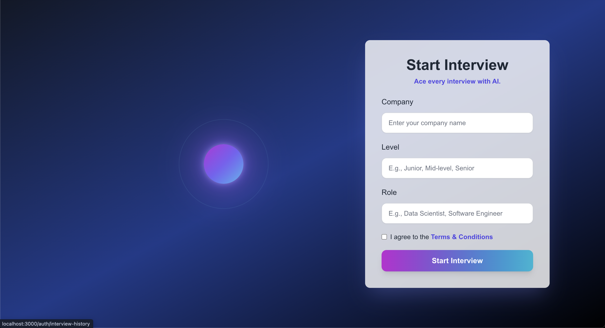

This is a [Next.js](https://nextjs.org) project bootstrapped with [`create-next-app`](https://nextjs.org/docs/app/api-reference/cli/create-next-app).

## Getting Started

First, run the development server:

```bash
npm run dev
# or
yarn dev
# or
pnpm dev
# or
bun dev
```

Open [http://localhost:3000](http://localhost:3000) with your browser to see the result.

You can start editing the page by modifying `app/page.tsx`. The page auto-updates as you edit the file.

This project uses [`next/font`](https://nextjs.org/docs/app/building-your-application/optimizing/fonts) to automatically optimize and load [Geist](https://vercel.com/font), a new font family for Vercel.

## Installation & Running Locally

Follow these steps to set up and run the project locally:

1. Clone the repository
   - git clone https://github.com/mohinikathro/AI-Mock-Interviewer-Submission.git
   - cd AI-Mock-Interviewer-Submission
  
2. Install frontend dependencies
   - run the following in the terminal
     - npm install
     - npm run dev


## Environment Setup
Also the .env file should be kept inside the my-auth-backend folder for authentication and API functionality. Please contact me on [LinkedIn](https://www.linkedin.com/in/mohini-kathrotiya/) if you need access for running the project locally.

## Demo
I have the demo of this project on my google drive : https://drive.google.com/file/d/1CFBYfDKHG15QJeAGJPcaTIIU8QtvgqVT/view?usp=drive_link

## Kiro Integration
This project leverages [Kiro](https://kiro.dev/) to power the AI-driven mock interview functionality. Kiro is used for:

1. Specs
   - Defined the interview flow using .kiro specs (interview_flow)

   - Workflow includes:
     - Selecting interview type (behavioral, technical, system design)
     - Dynamically asking questions based on type
     - Collecting user responses
     - Generating structured feedback
      
2. Hooks
   - Automated actions such as:
     - Generating a feedback report (feedback_report.md) after each interview
     - Logging responses and scores for history and analytics
   - Hooks streamline repetitive tasks, making the app faster and more reliable
 
3. Steering
   - Provided instructions to guide AI behavior:
     - Use STAR method for behavioral questions
     - Keep questions realistic and role-specific
     - Modular design to add new interview types easily
   - Steering ensures AI outputs are consistent, structured, and actionable
     
4. How Kiro Improves Development
   - Reduces manual coding of conversation logic
   - Ensures AI follows clear rules for evaluation and feedback
   - Makes the system easily extensible for future interview types

## Sign up Page


## Home page


## Start Interview UI


## Dashboard


## Interview History


## Learn More

To learn more about Next.js, take a look at the following resources:

- [Next.js Documentation](https://nextjs.org/docs) - learn about Next.js features and API.
- [Learn Next.js](https://nextjs.org/learn) - an interactive Next.js tutorial.
- [Next.js GitHub repository](https://github.com/vercel/next.js)

## Deploy on Vercel

The easiest way to deploy your Next.js app is to use the [Vercel Platform](https://vercel.com/new?utm_medium=default-template&filter=next.js&utm_source=create-next-app&utm_campaign=create-next-app-readme) from the creators of Next.js.

Check out [Next.js deployment documentation](https://nextjs.org/docs/app/building-your-application/deploying) for more details.


